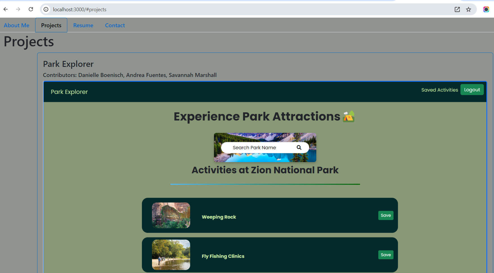

# React Portfolio

## Description
A professional portfolio using React that displays navtabs for an About, Projects, Resume, and Contact sections.

## Table of Contents
- [Installation](#installation)
- [Usage](#usage)
- [License](#license)
- [Questions](#questions)

## Installation
- Run npm create vite
- Enter name of folder, use React and Javascript
- Run npm install
- Install bootstrap using npm install bootstrap@v5.2.3
- Run npm dev and navigate to the URL to see the app

## Usage
[Deployed Site]()

## License

This project is licensed under the [MIT](https://opensource.org/licenses/MIT) license.

## Questions
[GitHub profile](github.com/MattAJ26) email: mattajohnson26@gmail.com
-Here you can find my contact info to reach out to me with any questions about this project.